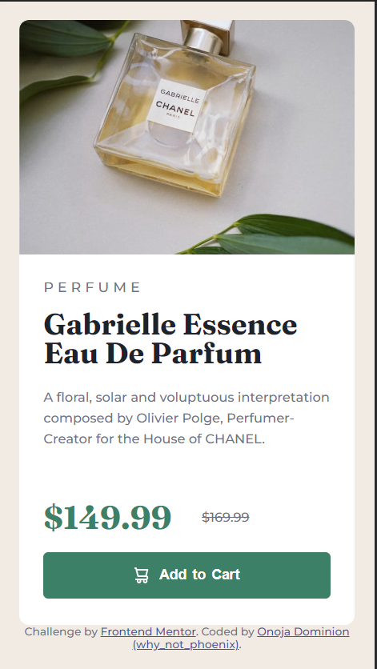
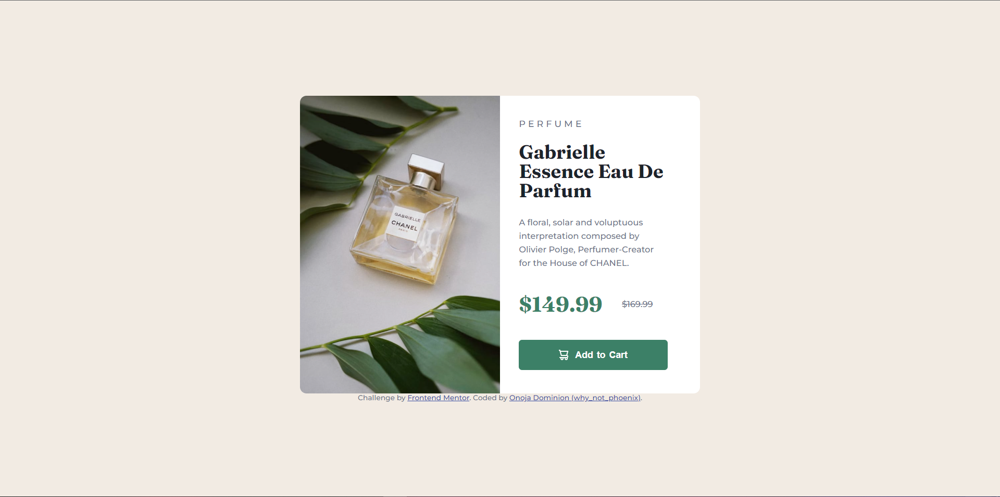

# Frontend Mentor - Product preview card component solution

This is a solution to the [Product preview card component challenge on Frontend Mentor](https://www.frontendmentor.io/challenges/product-preview-card-component-GO7UmttRfa). Frontend Mentor challenges help you improve your coding skills by building realistic projects.

## Table of contents

- [Overview](#overview)
  - [The challenge](#the-challenge)
  - [Screenshot](#screenshot)
  - [Links](#links)
- [My process](#my-process)
  - [Built with](#built-with)
  - [What I learned](#what-i-learned)
  - [Continued development](#continued-development)
  - [Useful resources](#useful-resources)
- [Author](#author)
- [Acknowledgments](#acknowledgments)

**Note: Delete this note and update the table of contents based on what sections you keep.**

## Overview

### The challenge

Users should be able to:

- View the optimal layout depending on their device's screen size
- See hover and focus states for interactive elements

### Screenshot






### Links

- Solution URL: [https://github.com/why-not-phoenix/Responsive-Product-Preview-Card.git](https://github.com/why-not-phoenix/Responsive-Product-Preview-Card.git)
- Live Site URL: [https://why-not-phoenix.github.io/Responsive-Product-Preview-Card/](https://why-not-phoenix.github.io/Responsive-Product-Preview-Card/)

## My process

### Built with

- Semantic HTML5 markup
- CSS custom properties
- Flexbox
- Mobile-first workflow

### What I learned

Learnt how to use the hover state of one element to affect another element.

```css
.purchase-button:hover ~ .product-paragraph {
  font-size: 1.2rem;
}
```

### Continued development

As always, still trying to find my feet in responsiveness but I am definitely improving. This was fun.

## Author

- Website - [Dominion Onoja](https://why-not-phoenix.github.io/cv/) - Very temporary site
- Frontend Mentor - [@why-not-phoenix](https://www.frontendmentor.io/profile/why-not-phoenix)
- Twitter - [@dominion_onoja](https://twitter.com/dominion_onoja)

## Acknowledgments

Got the idea for using hover of one element to affect another from [Stack Overflow](https://stackoverflow.com/questions/4502633/how-to-affect-other-elements-when-one-element-is-hovered).
